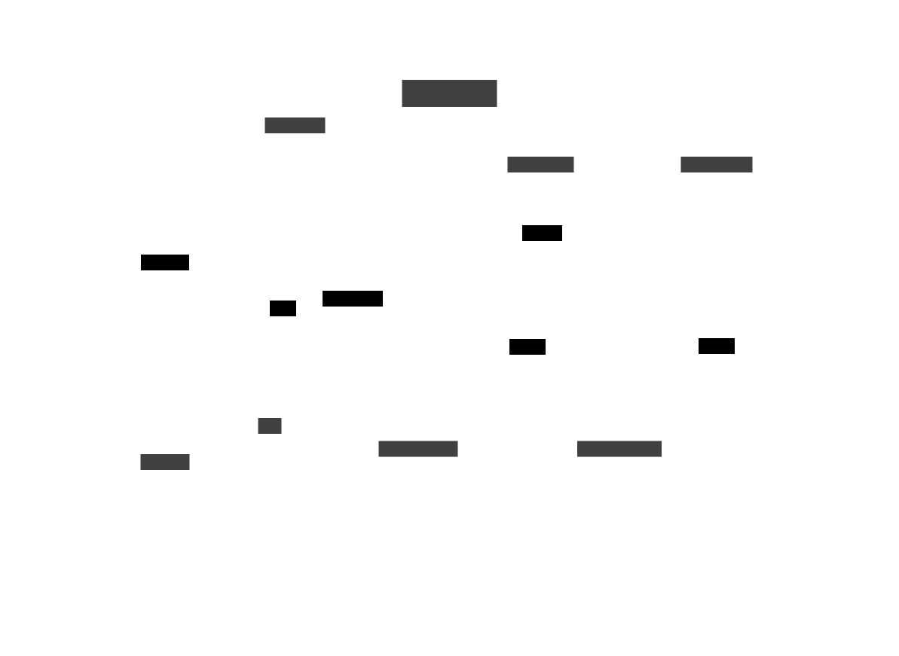

This example shows how to execute a database purging using **MinMax** method and trigger Rendez-Vous.

# Context

This example will archive Domestik2's `electricity_power` table.

# Files

- `database.pgsql` Database access configuration **MUST BE CUSTOMISED AS PER YOUR NEEDS**
- `now.timer` launch the archiving ... now.
- `ArchPower.archiving` Archiving definition
- `ArchivingDone.rendezvous` and `ArchivingFailed.rendezvous` Rendez-vous triggered when the archiving is finished, respectively successfully or not
- `notifyDone.lua` and `notifyFailed.lua` tasks called to log
