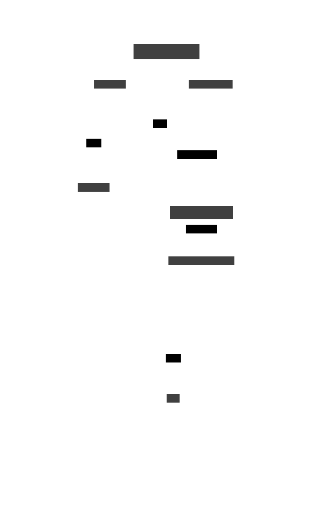

This is an example of usage of **howmany** : the tracker will wait for *how many* positive checks before becoming DONE.

Following objects are created :
- `Test.topic` - subscribes to a topic **Test** to receive data
- `TestTrackerHM.tracker` - A tracker waiting for 3 incoming data > 10

- `ControlHM.topic` - subscribes to a topic **ControlHM** to send command to the tracker. Recognized command is :

  * **STATUS** : displays the tracker status
--->

---

To test it, create a config file like this :

	# URL to reach the broker
	Broker_URL=tcp://torchwood.local:1883

	# Application directory
	ApplicationDirectory=Documentations/SamplesCode/Tracker_HowMany

