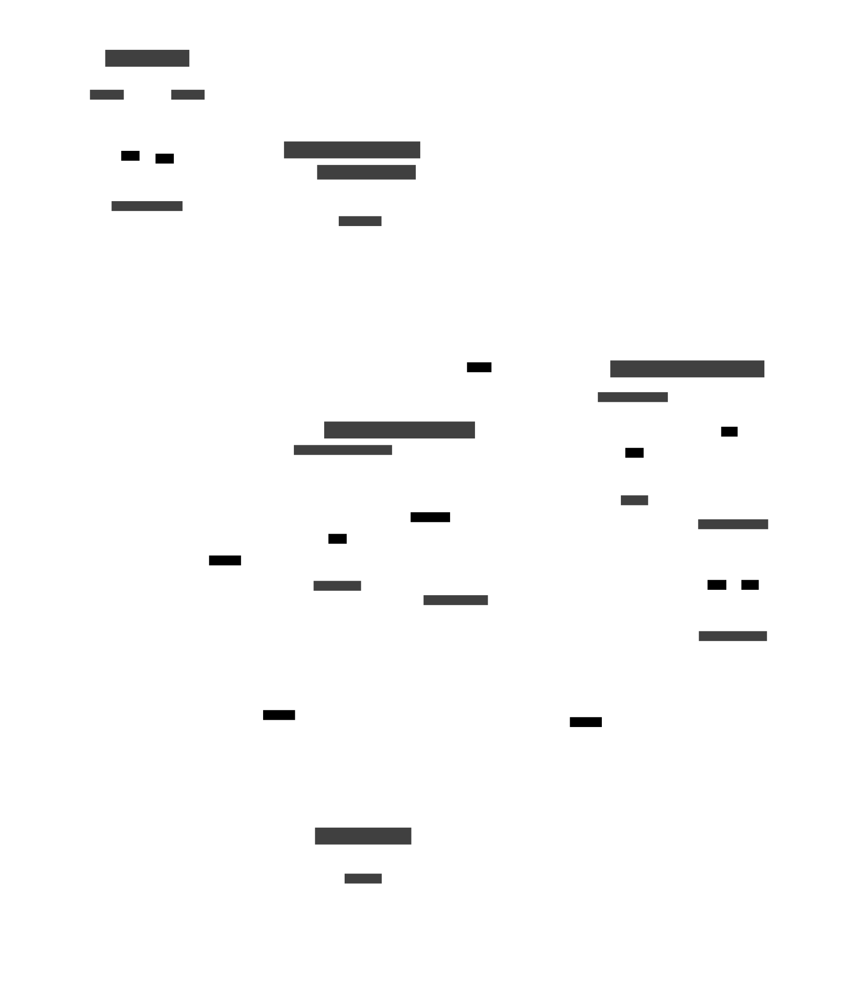

# Goal
Real-life use case: how I collect temperatures at my home 
(*in addition to the utility aspect, my home automation also serves as a full-scale Majordome test*).

Temperatures came from topic `maison/Temperature/#` hierarchy, randomly, at frequencies needed by my real time dashboard.

There is no usage to keep such *high* frequency for a database storage, so data are first aggregated using **namedminmax** facilities. 
Finally, data are aggregated further for long term storage and hot data table purged

