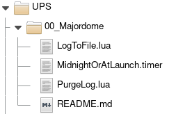

Step by step data complete data cycle tutorial
---

In this tutorial, we'll see how to handle a complete data life cycle with Majordome unique 
**No-Code**/**Low-Code** features.


📊 Data will be ingested as **time-series** data into a **PostgreSQL database**, aggregated as statistics,
archived, and finally purged : **a total data cycle life with low efforts**.<br>
🧾 Graphical diagrams will be generated as well to make easier documentation and understanding
of the overall process.

At user side, data will be visualized through the industries standard **Grafana**.

---

## Preamble

As an example, we will take data issued by a UPS where data are published through MQTT. A data set is published every 15 seconds.

```
onduleur/input.transfer.low	180
onduleur/input.transfer.high	280
onduleur/input.voltage	234.0
onduleur/battery.charge.warning	20
onduleur/battery.charge	100
onduleur/ups.realpower.nominal	480
onduleur/ups.load	35
```

> [!TIP]
> For devices not able to publish to MQTT,
> my [Marcel](https://github.com/destroyedlolo/Marcel) daemon can be used
> as a gateway as long as it is supported by NUT : take a look on **mod_ups**.

> [!NOTE]
> Installation and configuration of a **MQTT broker** (Mosquitto suggested), **PostgreSQL server**,
> and **Majordome** itself are definitively out of the scope of this tutorial.

---

## ⚙️ Project setup

1. Creates a directory dedicated to this project and copy inside `00_Majordome` from the
examples provided in this repository. It will implemente Majordome's own log cycling.



2. `10_Configuration` will contain a timer definition used to cadence the statistics aggregation.


`5Minutes.timer`
```
-->> desc=Timer to launch an action every 5 minutes
-->> every=300
```

And `database.pgsql` is declare database acces :
```
-- Declare the database to connect to
-- Connection string : see PostgreSQL documentation
-- Something like :
--	postgresql://[user[:password]@][[host][:port][,...]][/dbname][?name=value[&...]]
-->> pgConnectionstring=postgresql://domestik2@localhost/www
```

---

## 📡 Data gathering - 50_UPS


1. 📥 **incoming topic** : `UPS.topic`

Defines were data are comming from.

```
-->> desc=Root of the UPS topic tree
-->> group=UPS
--
-->> topic=onduleur/#
--
-->> quiet
--->> disabled
```

2. 🗃️ **In-Memory Aggregator** : `UPS.namedminmax`

From a business point of view, having such a data rate is useful for the real-time dashboard (*also powered by Majordome 😉*), it's not needed for medium or long term storage in the database : an aggregation on 5 minutes basis is enough.

This collection will have only one key : the name of the figure to store. As a consequence, a [namedminmax](../../Documentations/NamedMinMax.md) is used.

```lua
-->> desc=Collect and aggregate data
-->> group=UPS
--
-->> listen=UPS
--
-->> quiet

local figure = MAJORDOME_TOPIC:match("onduleur/(.+)")

if MAJORDOME_VERBOSE then
	SelLog.Log("I", "Got figure ".. figure)
end

return {figure}
```

The `-->> listen=UPS` indicates which topic to listen too, here the defined previously in `UPS.topic`.

The trailing Lua code extracts the figure name from the incoming topic, which is expected as the code's return value.

> [!TIP]
> Some of those values are only parameters and don't need to be stored.
> Following code ignore them
> ```lua
> -- Extract the figure's name
> local figure = MAJORDOME_TOPIC:match("onduleur/(.+)")
>
> -- list of rejected figures
> local rejected = {
>	["battery.charge.warning"] = true,
>	["input.transfer.high"] = true,
>	["input.transfer.low"] = true,
>	["ups.realpower.nominal"] = true,
> }
>
> if rejected[figure] then
>	return false
> end
>
> if MAJORDOME_VERBOSE then
>	SelLog.Log("I", "Got figure ".. figure)
> end
>
> return figure
> ```

3. 🐘 **Database storage** `UPS.namedminmax`

An [aggregatedfeed](../../Documentations/Database/aggregatedfeed.md) is periodically used to store in-memory statistics to a PostgreSQL table.

```
-->> desc=Store UPS figures in the database
-->> group=UPS
--
-->> when=5minutes
--
-->> from NamedMinMax=UPS
-->> figure=MMA
--
-- Where to store
-->> Database=database
-->> table=ups
--
--->> quiet
--->> disabled
```

Where :
- `-->> when=5minutes` is defining the timing : the data will be aggregated every 5 minutes.
- `-->> from NamedMinMax=UPS` the data source
- `-->> figure=MMA` aggregation kind. Here, we will store **min/Max/average** statistics.
- `-->> Database=domestik2` and `-->> table=ups` where data will be stored.

The table's definition looks like
```sql
CREATE TABLE :Domestik_Schema.UPS (
	sample_time TIMESTAMP WITH TIME ZONE,
	figure TEXT NOT NULL,
	minimum INTEGER,
	maximum INTEGER,
	average FLOAT
);
```

Data being stored in our database, generating graphics in Grafana is now straightforward.


---

## 📦 Archiving - 50_UPSArchiving

Keeping such detailed figures is generally unneeded for long-term trending studies. To save space and improve search performance, data are again aggregated with a larger timeframe.


1. ⏰ When the purging will be done `UPSArchive.timer`
```
-->> desc=When UPS figures will be archived
-->> group=UPS
-->> at=0400
```

2. 📦 Archiving object

The target table (identical to the UPS one) :
```sql
CREATE TABLE :Domestik_Schema.UPS_archive (
	sample_time TIMESTAMP WITH TIME ZONE,
	figure TEXT NOT NULL,
	minimum INTEGER,
	maximum INTEGER,
	average FLOAT
);
```

[archiving](../../Documentations/Database/archiving.md) object definition :

```
-->> desc=When UPS figures will be archived
-->> group=UPS
--
-->> when=UPSArchive
--
--->> quiet
--
------------
-- Database related
------------
--
-->> Database=database
-->> source=ups
-->> table=ups_archive
-->> Keys=figure
--
------------
-- Data selection
------------
--
-->> AggregateBy=Day
-->> Kind=MMA2
-->> UpTo=1 day
--
---------------
-- Notification
---------------
--
-->> SuccessRDV=UPSArchivingDone
```

- `-->> Keys=figure` : data are *named* by the *figure* field.
- `-->> AggregateBy=Day` : All data will be grouped by days. Minimum, Maximum and Average values will be kept for each day.
- `-->> Kind=MMA2` : Both source and target tables store min/max/average values. Other kinds are managing only "single" figure's table to an *min/max/average* one.
- `UpTo=1 day` : We are considering all data older than today.

3. 🔔 Notification

`UPSArchivingDone.rendezvous` will be used to launch purging as explained bellow.
```
-->> desc=When UPS figures will be archived
-->> group=UPS
```

---

## 🧹 Purging

Only the archived data are kept : the recent-data table is purged for obsolete data.

---

## 📊 Reporting

---

## 🚀 Running
